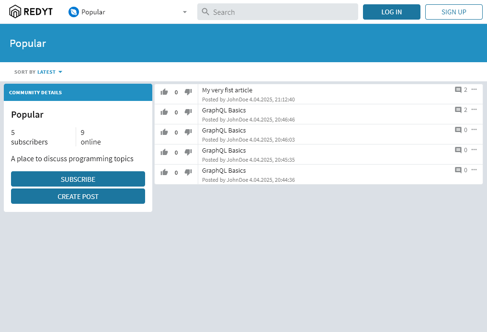
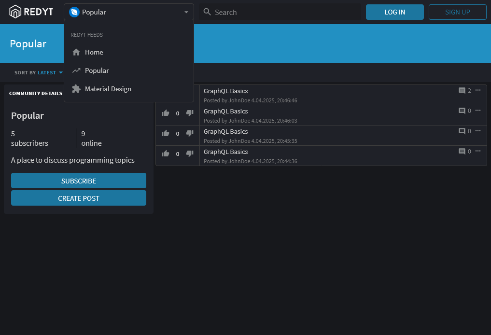
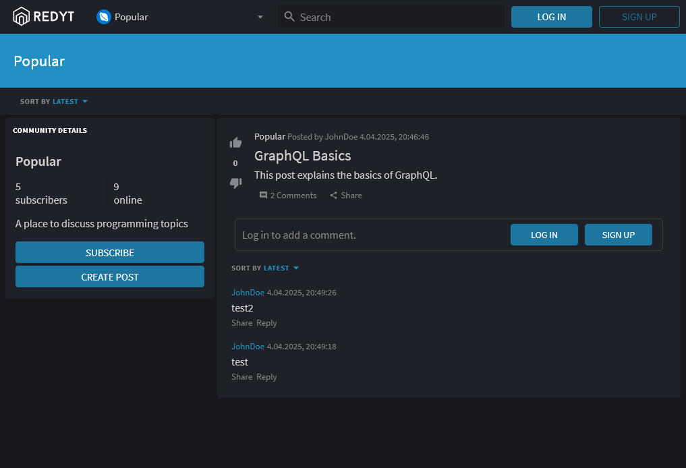

# Redyt

Redyt is a Reddit-inspired web application built with modern web technologies. It allows users to explore subforums, create posts, and interact with a community.

## Screenshots





## Features

- **User Authentication**: Login and register functionality with form validation.
- **Subforums**: Browse and interact with various subforums.
- **Post Creation**: Create and view posts with rich content.
- **Responsive Design**: Fully responsive UI for desktop and mobile devices.
- **Theming**: Light and dark mode support with customizable subforum themes.
- **GraphQL Integration**: Efficient data fetching and state management using Apollo Client.
- **Lazy Loading**: Optimized performance with React's `React.lazy` and `Suspense`.

## Technologies Used

- **React**: Component-based UI development.
- **TypeScript**: Strongly typed JavaScript for better maintainability.
- **GraphQL**: API querying with Apollo Client.
- **Material-UI**: Styling and theming with Material-UI's `@material-ui/styles`.
- **Webpack**: Module bundling and development server.
- **Apollo Server**: Backend GraphQL server for handling API requests.
- **CSS-in-JS**: Styling components using `makeStyles` from Material-UI.
- **React Router**: Client-side routing for navigation.

## Project Structure

The project is organized into the following key directories:

- **`src/components`**: Contains all React components, including UI elements, forms, and views.
- **`src/theme`**: Defines light and dark themes for the application.
- **`src/contexts`**: Contexts for managing global state, such as theming and sorting.
- **`src/reducers`**: Reducers for handling state updates.

## Getting Started

### Prerequisites

- Node.js (v12)
- yarn

### Installation

1. Clone the repository:
   ```bash
   git clone https://github.com/moustaxx/redyt-react.git
   cd redyt-react
   ```

2. Install dependencies:
   ```bash
   yarn install
   ```

3. Start the development server:
   ```bash
   yarn start
   ```

4. Open the application in your browser:
   ```
   http://localhost
   ```

### Build for Production

To build the project for production, run:
```bash
yarn build
```

The output will be available in the `dist` directory.